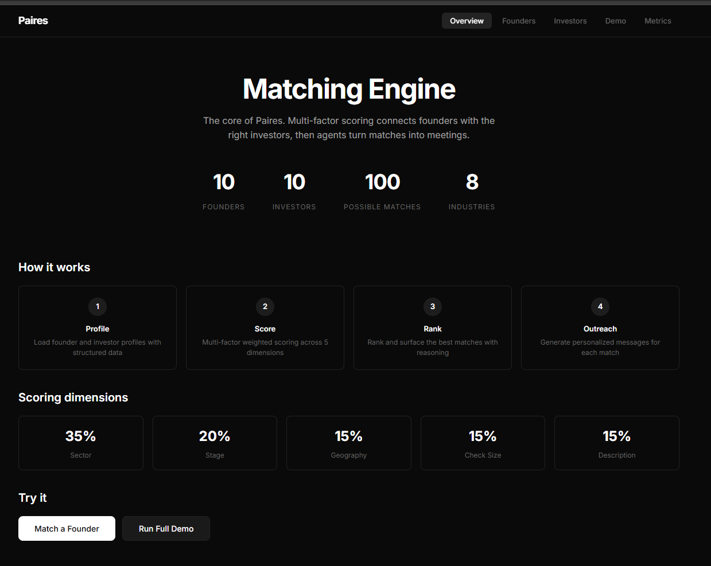

# Paires Matcher Engine v2



Production-level matching engine demo for the **Founding AI Engineer** role at Paires.

This is the **core product** of Paires — the two-sided matching engine that pairs founders with the right investors, plus the agent layer that turns matches into booked meetings.

## Quick Start

```bash
git clone https://github.com/mysterious75/Paires-Matcher-Engine.git
cd Paires-Matcher-Engine/backend
pip install -r requirements.txt
python -m uvicorn app:app --host 0.0.0.0 --port 8001
```

Open **http://localhost:8001/docs** for interactive API docs.

## Prerequisites

| Requirement | Version | How to Check |
|-------------|---------|--------------|
| Python | 3.9+ | `python --version` |
| pip | 20+ | `pip --version` |
| Git | Any | `git --version` |

No Node.js required (backend-only demo). Frontend source included for reference.

## Installation

### Step 1: Clone the Repository

```bash
git clone https://github.com/mysterious75/Paires-Matcher-Engine.git
cd Paires-Matcher-Engine
```

### Step 2: Install Python Dependencies

```bash
cd backend
pip install -r requirements.txt
```

**Dependencies:**

| Package | Purpose |
|---------|---------|
| `fastapi` | Web framework |
| `uvicorn` | ASGI server |
| `pydantic` | Data validation |
| `sentence-transformers` | Real embeddings (all-MiniLM-L6-v2) |
| `scikit-learn` | ML utilities |
| `numpy` | Numerical operations |

### Step 3: Start the Server

```bash
python -m uvicorn app:app --host 0.0.0.0 --port 8001
```

### Step 4: Open the API Docs

Navigate to **http://localhost:8001/docs** in your browser.

## Platform-Specific Instructions

### Linux (Ubuntu/Debian)

```bash
# Install Python if not present
sudo apt update
sudo apt install python3 python3-pip -y

# Clone and setup
git clone https://github.com/mysterious75/Paires-Matcher-Engine.git
cd Paires-Matcher-Engine/backend
pip3 install -r requirements.txt

# Run
python3 -m uvicorn app:app --host 0.0.0.0 --port 8001
```

### macOS

```bash
# Install Python via Homebrew (if needed)
brew install python

# Clone and setup
git clone https://github.com/mysterious75/Paires-Matcher-Engine.git
cd Paires-Matcher-Engine/backend
pip3 install -r requirements.txt

# Run
python3 -m uvicorn app:app --host 0.0.0.0 --port 8001
```

### Windows

```powershell
# Install Python from https://python.org (check "Add to PATH")

# Clone and setup
git clone https://github.com/mysterious75/Paires-Matcher-Engine.git
cd Paires-Matcher-Engine\backend
pip install -r requirements.txt

# Run
python -m uvicorn app:app --host 0.0.0.0 --port 8001
```

### Using Virtual Environment (Recommended)

```bash
# Create virtual environment
python -m venv venv

# Activate it
# Linux/macOS:
source venv/bin/activate
# Windows:
venv\Scripts\activate

# Install dependencies
pip install -r requirements.txt

# Run
python -m uvicorn app:app --host 0.0.0.0 --port 8001

# Deactivate when done
deactivate
```

## What's Inside

### Core Matching Engine (`matcher_engine.py`)
- **Real embeddings** using `sentence-transformers` (all-MiniLM-L6-v2)
- **5-dimension weighted scoring**: sector (25%), stage (15%), geography (10%), check size (10%), **embedding similarity (40%)**
- **Feedback loop** — tracks meeting bookings, improves over time
- **Multi-factor ranking** with human-readable match reasons

### Database Layer (`database.py`)
- **SQLite persistence** for all data
- Matches, feedback, outreach logs stored permanently
- Production-ready schema with foreign keys

### Embedding Engine (`embeddings.py`)
- **Sentence-transformers** (all-MiniLM-L6-v2) for real semantic similarity
- Cosine similarity scoring between founder and investor profiles
- Batch embedding support

### Agent Layer (`match_agent.py`)
- Personalized outreach for every matched founder-investor pair
- Tone adapts based on match quality
- Key selling points extracted per match

### Evaluation Framework
- Conversion rate tracking (meeting bookings / total matches)
- Score distribution (high/medium/low)
- Recent matches and feedback history

## Architecture

```
MatcherEngine
├── embeddings.py      # Real vector embeddings (sentence-transformers)
├── database.py        # SQLite persistence
├── _score_sector()    # Industry alignment
├── _score_stage()     # Stage compatibility
├── _score_geography() # Region matching
├── _score_check_size()# Deal size fit
└── score_match()      # Semantic similarity (40% weight)

MatchAgent
└── generate_outreach() # Personalized messaging
```

## API Endpoints

| Endpoint | Method | Purpose |
|----------|--------|---------|
| `/api/health` | GET | Health check (v2.0.0, embedding model, DB status) |
| `/api/founders` | GET | List 10 founder profiles |
| `/api/investors` | GET | List 10 investor profiles |
| `/api/match/founder/{id}` | POST | Find best investors with embedding scores |
| `/api/match/investor/{id}` | POST | Find best founders for an investor |
| `/api/match/all` | POST | Run full two-sided matching |
| `/api/outreach/generate` | POST | Generate personalized outreach |
| `/api/feedback` | POST | Record meeting bookings |
| `/api/evals` | GET | Get matching engine metrics |
| `/api/evals/recent` | GET | Recent matches from database |
| `/api/evals/feedback` | GET | Recent feedback from database |
| `/api/demo/run` | POST | Run full demo |

## Testing

```bash
# Run full test suite
python test_v2.py

# Run quality deep check
python test_quality.py
```

## v2 vs v1

| Feature | v1 | v2 |
|---------|----|----|
| Scoring | Keyword matching | **Real embeddings (40% weight)** |
| Storage | In-memory | **SQLite database** |
| Persistence | None | **Full match/feedback/outreach logging** |
| Model | N/A | **sentence-transformers all-MiniLM-L6-v2** |

## Troubleshooting

### "No module named 'sentence_transformers'"
```bash
pip install sentence-transformers
```

### "Port 8001 already in use"
```bash
# Find and kill the process using port 8001
# Linux/macOS:
lsof -ti:8001 | xargs kill -9
# Windows:
netstat -ano | findstr :8001
taskkill /PID <PID> /F
```

### Slow first request
First request loads the embedding model (~80MB). Subsequent requests are fast.

### SQLite database location
Database is created at `backend/matcher.db` automatically on first run.

## Tech Stack

| Layer | Technology |
|-------|-----------|
| **Backend** | FastAPI (Python) |
| **Embeddings** | sentence-transformers (all-MiniLM-L6-v2) |
| **Database** | SQLite |
| **Matching** | Multi-factor weighted scoring + cosine similarity |
| **API Docs** | Swagger UI (auto-generated) |

Built for the **Paires Founding AI Engineer** role.
